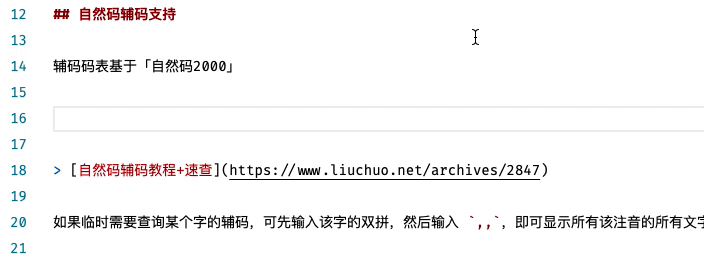
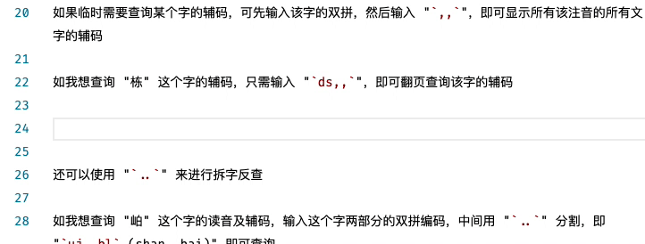
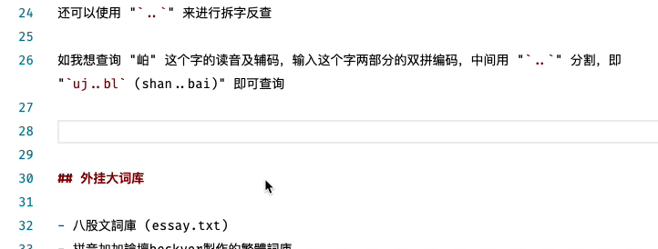
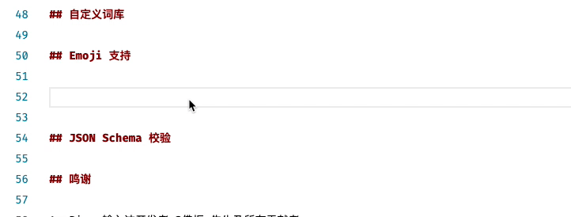

# Rime double pinyin plus

双拼输入法增强版

基于朙月拼音＋自然码双拼方案。

- 增加自定义短语(custom phrase)。
- 增加英文输入支持，支持大写字母
- 增加自然码辅码支持(自然码 2000)
- 增加 Emoji 支持
- 方便、安全的配置方式 (json schema 校验)

## 自然码辅码支持

辅码码表基于「自然码 2000」 [自然码辅码教程+速查](https://www.liuchuo.net/archives/2847)

如果临时需要查询某个字的辅码，可先输入该字的双拼，然后输入 "`,,`"，即可显示所有该注音的所有文字的辅码

如我想查询 "栋" 这个字的辅码，只需输入 "`ds,,`"，即可翻页查询该字的辅码

还可以使用 "`..`" 来进行拆字反查

如我想查询 "岶" 这个字的读音及辅码，输入这个字两部分的双拼编码，中间用 "`..`" 分割，即 "`uj..bl` (shan..bai)" 即可查询

## 外挂大词库

- 八股文詞庫 (essay.txt)
- 拼音加加論壇 beckyer 製作的繁體詞庫
- 小麥注音輸入法詞庫
- 新酷音共享詞庫
- 詞庫网
- 敎育部詞頻統計表
- 維基百科
- 漢語大詞典
- 英语单词 (5.4W 词)
- 中英混输词库
- 计算机领域词库

感谢词库的整理者们！

> 如需 47.9W 词的英语词库和日语词库，请前往 [lippmann/lrime](https://github.com/lippmann/lrime)

## 自定义短语

在 `custom_phrase.txt` 中添加你的短语，如邮箱、特定短语等，即可快速上屏

> 请注意，"短语-编码-权重" 之间使用 <kbd>Tab</kbd> 制表符分隔。

## Emoji 支持

## JSON Schema 校验

根据 schema 定义配合 JSON Schema，可以达到验证 schema 格式、对描述进行提示的用途。

请注意，该功能需要 VSCode 及其 YAML 插件。

> JSON Schema description 来自 [LEOYoon-Tsaw/Rime_collections](https://github.com/LEOYoon-Tsaw/Rime_collections/blob/master/Rime_description.md)

## 鸣谢

1. Rime 输入法开发者 @佛振 先生及所有贡献者；
1. 自然码输入法开发者 @周志农 先生；
1. Rime 版带辅码自然码方案「自然码 2000」的制作者 [@henices](http://github.com/henices)；
1. 英文词库来自 GitHub 用户 [@dwyl](https://github.com/dwyl)；
1. 混输方案来自 GitHub 用户 [@lippmann](https://github.com/lippmann/lrime)
